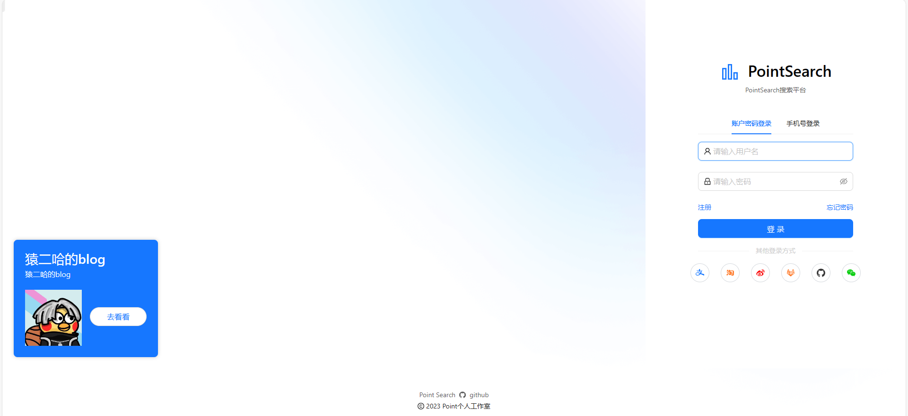
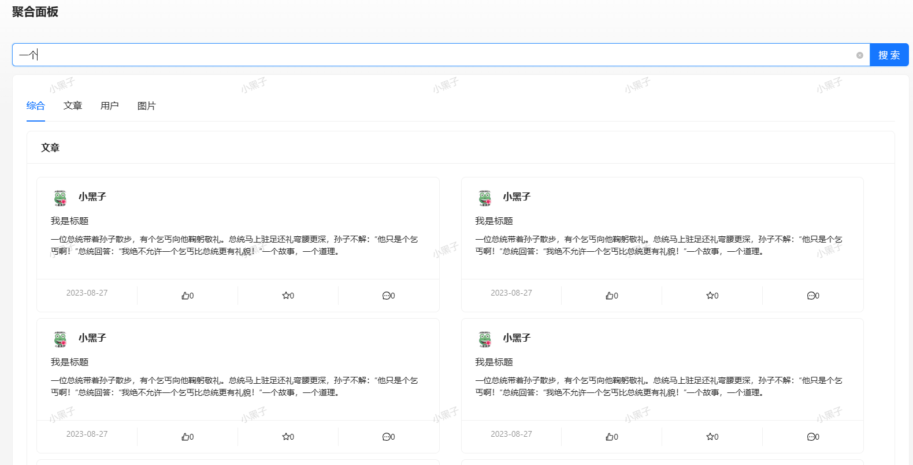
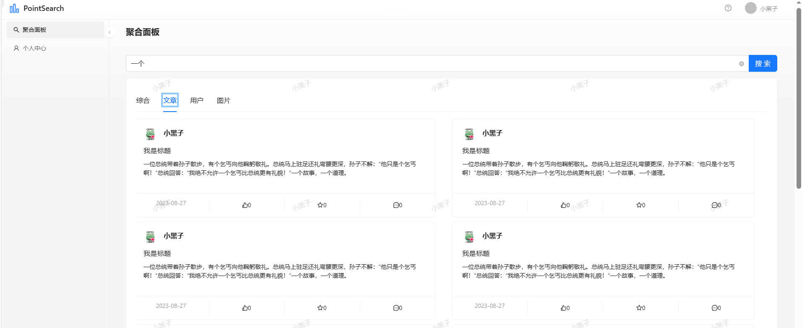
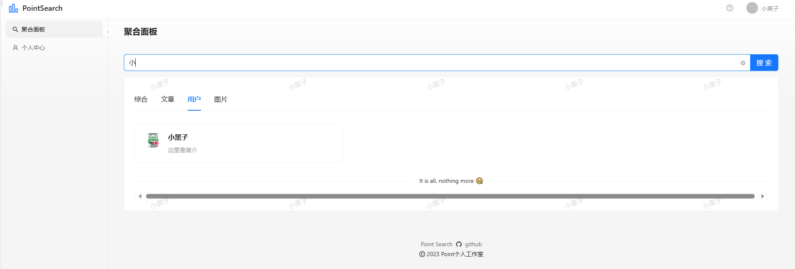
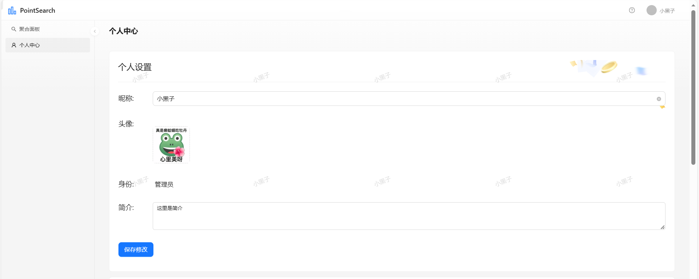
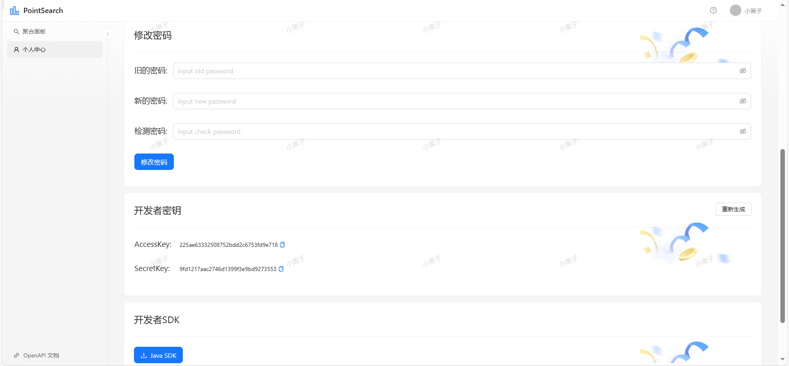

# Ant Design Pro

This project is initialized with [Ant Design Pro](https://pro.ant.design). Follow is the quick guide for how to use.

## Environment Prepare

Install `node_modules`:

```bash
npm install
```

or

```bash
yarn
```

## Provided Scripts

Ant Design Pro provides some useful script to help you quick start and build with web project, code style check and test.

Scripts provided in `package.json`. It's safe to modify or add additional script:

### Start project

```bash
npm start
```

### Build project

```bash
npm run build
```

### Check code style

```bash
npm run lint
```

You can also use script to auto fix some lint error:

```bash
npm run lint:fix
```

### Test code

```bash
npm test
```

## More

You can view full document on our [official website](https://pro.ant.design). And welcome any feedback in our [github](https://github.com/ant-design/ant-design-pro).

# PointSearch聚合平台
- 基于 React + Spring Boot + Elastic Stack的一站式聚合搜索平台。
- 用户可在同一页面集中搜索出不同来源的文章，用户，图片等，提升搜索体验。
- 企业也可以直接将各项目的数据接入搜索平台，复用同一套搜索后端，提升开发效率、降低系统维护成本。
  
  
  
  
  
  
  
  


# 后端系统：pointsearch_backend
- 用户：登陆，注册（ak/sk），注销，获取列表
- 文章：发布，评论，点赞，收藏
- 搜索：综合搜索，搜索文章、用户、图片

# 搜索模块
- 基于自己二次开发的 Spring Boot 初始化模板 + MyBatis X 插件，快速生成用户模块，文章模块的增删改查
- 为解决图片数据源获取问题，使用 jsoup 实时 请求 bing 搜索接口获取图片，并使用 CSS Selector 语法解析和预处理图片信息，最终返回给前端
- 为实现多类数据源的整体搜索，使用门面模式 在后端对各类数据源的搜索结果进行聚合，统一返回给前端，将前端的请求次数由原先的3次减少到1次，降低了前端开发复杂度
- 为提高聚合搜索接口的通用性，通过定义数据源接口来实现统一的数据源接入标准；当新数据源要接入时，只需使用适配器模式对其数据查询接口进行封装、以适配数据源接口，提高了系统的可扩展性
- 为解决文章搜不准确的问题，搭建 Elasticsearch 来代替 MySQL 的模糊查询，并通过为索引绑定 ik 分词器实现了更灵活的分词搜索，使用 JMeter 测试后发现搜索文章qps从5提升到50
- 使用 Spring Scheduler 定时同步近 5 分钟内发生更新的 MySQL 的文章数据到 ES，通过唯一 id 来保证每条数据同步的准确性
- 为减少代码的圈复杂度，使用注册器模式代替 if else 来管理多个数据源对象，调用方可根据名称轻松获取对象，实测圈复杂度由5.00减少为 2.00。
- 构建 ES 文章索引时，采用动静分离的策略，只在 ES 中存储要检索的、修改不频繁字段用于检索，而修改频繁的字段从数据库中关联查出，从而减少了 ES 数据更新和同步的成本、保证数据一致性。
